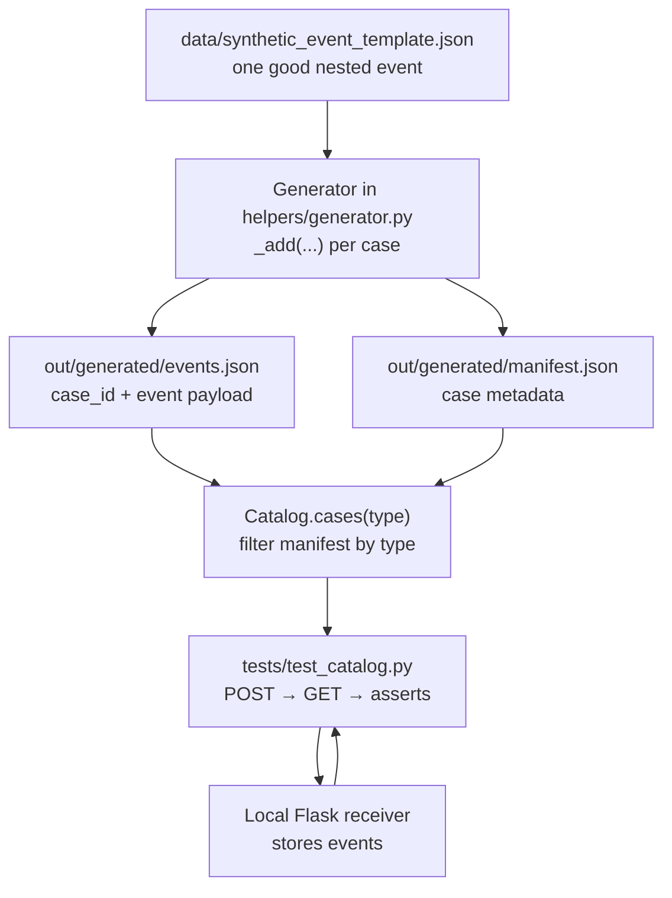
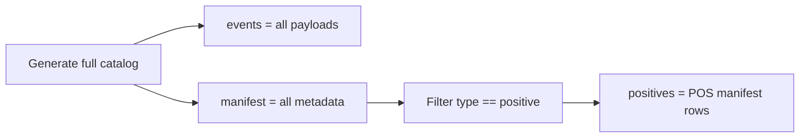
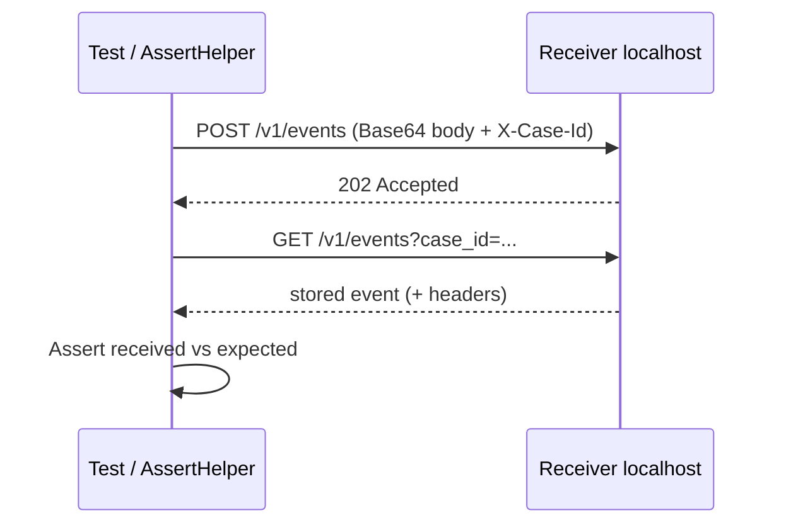

# Catalog tests — how they work

This guide explains the **catalog tests** in `tests/test_catalog.py`: where cases come from, what files are generated, and what each test checks.

**Per-test step-by-step docs** (line-by-line + differences): see [`docs/catalog_tests/`](catalog_tests/README.md).

It does **not** cover type tests (`EventsSchema.json` / corrupted dataset). Those live in `tests/test_data_types.py` — see [`docs/data_types_tests/`](data_types_tests/README.md).

---

## Big picture



**In one sentence:** we copy the synthetic template into many labeled cases, write them to two files, then each pytest function loads only the cases it cares about, sends them to a local server, reads them back, and checks the right thing.

---

## Step 1 — Source data (not all three data files)

Catalog cases are generated from **one** file:

| File | Role for catalog tests |
|------|-------------------------|
| `data/synthetic_event_template.json` | The good nested event we copy and sometimes mutate |

These are **not** used to build the catalog:

| File | Used for |
|------|----------|
| `data/EventsSchema.json` | Type checks in `test_data_types.py` |
| `data/validation_dataset_intentionally_corrupted.json` | Bad flat rows in `test_data_types.py` / `validate_dataset` |

---

## Step 2 — Creating test cases (the pipeline)

Cases are created in `helpers/generator.py` by `Generator.generate()`.

For each case the helper `_add(...)` is called with:

- `case_id` — unique id (e.g. `POS-0001`, `NEG-UUID`)
- `event` — the JSON payload to send (usually a deep copy of the template, sometimes with fields changed)
- `case_type` — bucket name: `positive`, `negative`, `boundary`, `duplicate`, `retry`, `replay`
- `intended_verdict` — `valid` or `invalid` (what we *intend* for this case)
- `target_rule_id` — which validator rule should fire for negatives (or `NONE`)
- `delivery_headers` — optional extra HTTP headers (retry / replay)

That way every case knows:

1. **What to send** (the event)
2. **How to classify it** (type)
3. **What outcome we designed** (verdict / target rule / headers)

### Example: one positive case

```python
add(
    events,
    manifest,
    "POS-0001",
    copy.deepcopy(base),   # unchanged template
    "positive",
    "valid",
    "NONE",
)
```

### Example: one negative case

```python
bad = copy.deepcopy(base)
bad["properties"]["UUID"] = ""   # break one field on purpose
add(events, manifest, "NEG-UUID", bad, "negative", "invalid", "REQ-UUID")
```

### How to add more cases

Edit `Generator.generate()` in `helpers/generator.py`: copy `base`, change what you need, call `_add` with the right `type` and `target_rule_id`. Then run `python run.py gen` or just pytest (tests regenerate automatically).

---

## Step 3 — The two generated files

After the pipeline runs (or when a test calls `Catalog.cases(...)`), you get:

### `out/generated/events.json`

**What it is:** the payloads to send.

Each item:

```json
{
  "case_id": "POS-0001",
  "event": { "event": "...", "properties": { ... } }
}
```

- Links `case_id` → full event body
- This is what gets Base64-encoded and POSTed to the receiver

### `out/generated/manifest.json`

**What it is:** the global index / metadata for **all** catalog cases.

Each item:

```json
{
  "case_id": "POS-0001",
  "type": "positive",
  "intended_verdict": "valid",
  "target_rule_id": "NONE",
  "delivery_headers": {}
}
```

| Field | Meaning |
|--------|--------|
| `case_id` | Same id as in `events.json`; also sent as `X-Case-Id` |
| `type` | Filter key for tests (`positive`, `negative`, …) |
| `intended_verdict` | Designed outcome: `valid` / `invalid` |
| `target_rule_id` | Rule that should appear for negatives (e.g. `REQ-UUID`); `NONE` if none |
| `delivery_headers` | Extra headers on POST (retry/replay); `{}` if none |

**Important:** neither file is generated *from* the other. Both are written together from the same `_add` calls. Also: when tests call `Catalog.cases()`, generation often happens in a **temp folder** that is deleted after load — so you may not see files on disk unless you run `python run.py gen`.

---

## Step 4 — How a catalog test loads its cases

In every catalog test you see a pattern like:

```python
events, positives = initialize.catalog.cases("positive")
```

What `Catalog.cases("positive")` does:

1. Run the generator (create events + manifest)
2. Load both into memory
3. Filter manifest rows where `type == "positive"`
4. Delete the temp generated folder
5. Return:
   - `events` — **all** payloads (every type)
   - `positives` (or negatives, …) — **only** the filtered manifest rows



The test then uses `case_id` to join: for each positive manifest row, look up the matching event in `events`.

---

## Step 5 — Shared fixtures

| Fixture | Role |
|---------|------|
| `initialize` | `BaseClass` with catalog, validator, logger, datasets |
| `catalog_receiver` | Fresh local receiver for this test (clean store) |

Flow for each case inside the helpers:



---

## Step 6 — Each test in `test_catalog.py`

### `test_positives`

**Goal:** After POST → GET, keys and values are unchanged (round-trip integrity).

**Steps:**

1. `events, positives = initialize.catalog.cases("positive")`  
   Load all events + positive manifest rows.
2. `AssertHelper.truthy(positives, "No positive cases in manifest")`  
   Fail early if the filter returned nothing (generator/filter problem).  
   This is **not** “manifest has no errors” — only “we have at least one positive case.”
3. `AssertHelper.check_positives(catalog_receiver, positives, events)`  
   For each positive case:
   - find the event by `case_id`
   - POST it
   - GET it back
   - assert `received == sent`

Does **not** run template required-field rules (`""` vs non-empty). That is left to negatives / other checks.

---

### `test_negatives`

**Goal:** Broken cases still round-trip, and the **target rule** fires on the received event.

**Steps:**

1. Load `type == "negative"`
2. Ensure the list is non-empty
3. For each case: POST → GET → equal payload → run `validator.check_nested` → assert `target_rule_id` is among findings

Examples of designed breaks: empty UUID → `REQ-UUID`, platform/`$os` mismatch → `XFIELD-OS`.

---

### `test_boundary`

**Goal:** Edge values behave as designed after GET.

**Cases (must exist):** `BND-0001`, `BND-TOKEN-SHORT`, `BND-TOKEN-EDGE`

**Checks (high level):**

- Round-trip equality for each
- `BND-0001`: `time == 0` after GET
- Short token: length = min−1 and `FMT` finding
- Edge token: length = min and no `FMT`

---

### `test_retry`

**Goal:** Same-style payload delivered twice with retry headers; payload intact; headers stored.

**Expects:** exactly two retry cases (`RTY-0001`, `RTY-0002`) with `Idempotency-Key` and `X-Retry-Count` in `delivery_headers`.

**Checks:** POST → GET → payload equal → stored headers match what we sent.

---

### `test_duplicates`

**Goal:** Two near-duplicate deliveries produce a `DUP-NEAR` finding on the received rows.

**Expects:** exactly two duplicate cases. POST both → GET both → run duplicate check → assert `DUP-NEAR`.

---

### `test_replay`

**Goal:** Replay pair both land and round-trip correctly (both deliveries visible via GET).

**Expects:** exactly two replay cases with replay-related `delivery_headers`. POST → GET → payload equal for each.

---

## Manifest fields (quick reference)

| Field | Used for |
|--------|----------|
| `case_id` | Join to `events.json`; HTTP `X-Case-Id` |
| `type` | Which test loads this case |
| `intended_verdict` | Design note (`valid` / `invalid`) |
| `target_rule_id` | Negative (and some boundary) expected rule |
| `delivery_headers` | Extra POST headers |

---

## Mental model for `test_positives` (your example, tightened)

1. **Generate** cases from the synthetic template via the pipeline (`_add`).
2. **Get two artifacts:**  
   - `manifest.json` — metadata for all cases  
   - `events.json` — `case_id` → payload to send  
3. **Filter** manifest by `"positive"`.
4. **`truthy(positives)`** — confirm we actually got positive cases (safe to start).
5. **`check_positives(...)`** — send each case to the local server, GET it back, expect the **same** keys and values.

---

## Related files

| Path | Role |
|------|------|
| `helpers/generator.py` | Create cases (`Generator`) |
| `src/pipeline.py` | Send generated cases (`Sender`) |
| `helpers/catalog.py` | Generate / load / filter cases for tests |
| `helpers/asserts.py` | `check_positives`, `check_negatives`, … |
| `tests/test_catalog.py` | One pytest per case type |
| `src/receiver.py` | Localhost POST/GET store |
| `tests/test_data_types.py` | Separate: schema types + corrupted dataset |
