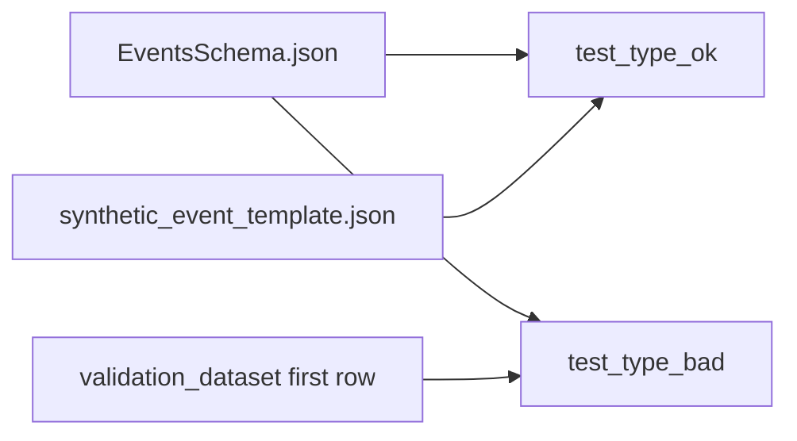

# Data-type test docs

One page per test in `tests/test_data_types.py`.

These tests are **not** the catalog (`events.json` / `manifest.json`). They use:

| File | Role |
|------|------|
| `data/synthetic_event_template.json` | Good nested event (positive types) |
| `data/validation_dataset_intentionally_corrupted.json` | Bad flat row — first row only (negative types) |
| `data/EventsSchema.json` | Expected field types (not a live DB) |

| Doc | Test | Touches server? | What it proves |
|-----|------|-----------------|----------------|
| [01-test_type_ok.md](01-test_type_ok.md) | `test_type_ok` | No | Good synthetic fields fit schema types |
| [02-test_type_bad.md](02-test_type_bad.md) | `test_type_bad` | No | Corrupted fields fail schema types |

Round-trip POST→GET is covered by catalog tests (`test_positives` / `test_negatives`), not duplicated here.

Catalog docs: [`../catalog_tests/`](../catalog_tests/README.md)

## Shared idea

**Type tests** check fixture values against the schema in memory only (no localhost).
